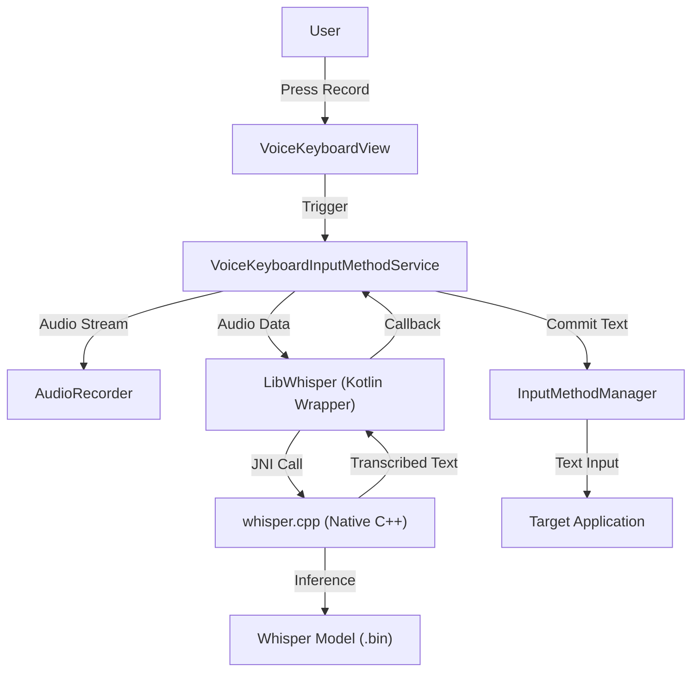
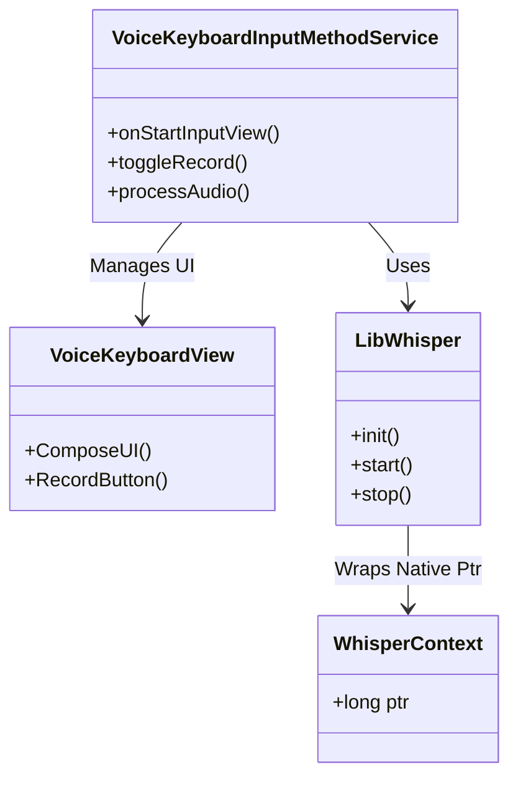
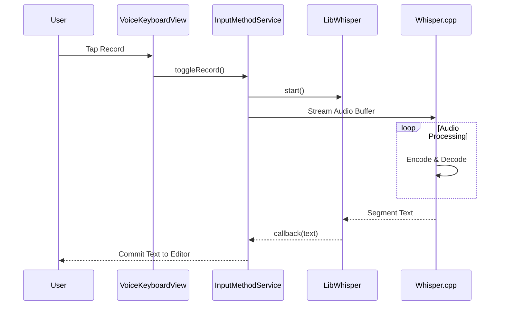

# Kaiboard Architecture

## High-Level Architecture
The application follows a standard Android service architecture, integrating native C++ code via JNI.

## Component Diagram

## Sequence Diagram: Transcription Flow

