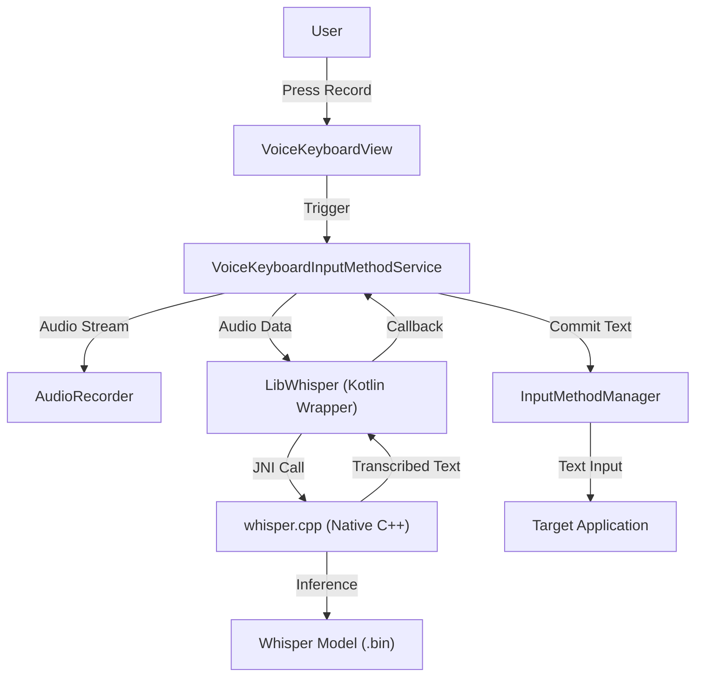
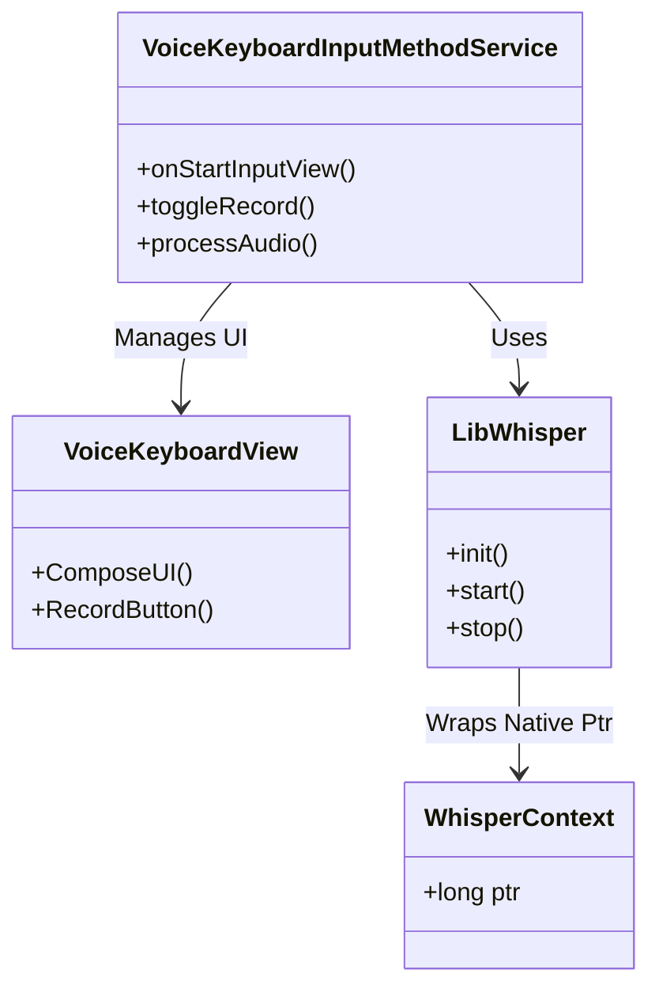
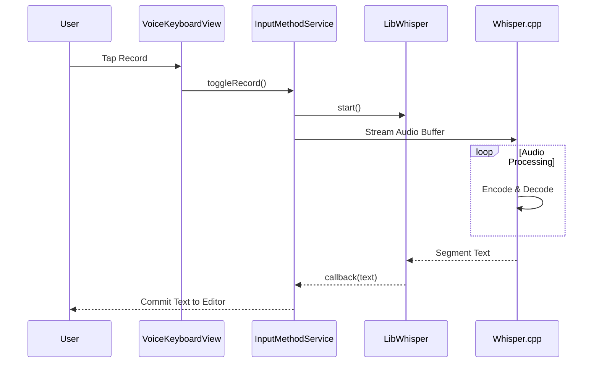

# Kaiboard Documentation

## 1. Introduction
Kaiboard is an open-source Android keyboard that brings the power of OpenAI's Whisper model directly to your device. It performs offline speech recognition using `whisper.cpp`, ensuring full privacy and zero server dependency.

## 2. Architecture

### High-Level Architecture
The application follows a standard Android service architecture, integrating native C++ code via JNI.

### Component Diagram

### Sequence Diagram: Transcription Flow

## 3. Technology Architecture

| Layer | Technology | Description |
|-------|------------|-------------|
| **UI Layer** | Jetpack Compose | Modern, declarative native UI for Android. |
| **Service Layer** | Kotlin | Android InputMethodService implementation. |
| **Bridge Layer** | JNI (Java Native Interface) | Communication between Java/Kotlin and C++. |
| **Core Engine** | C++ (whisper.cpp) | High-performance inference engine for Whisper models. |
| **Model Format** | GGML / GGUF | Quantized binary format for efficient edge inference. |
| **Build System** | Gradle + CMake | Android build toolchain integrating C++ compilation. |

## 4. Use Cases and Features

### Core Use Cases
-   **Offline Dictation**: Transcribe speech to text without an internet connection.
-   **Privacy-First Typing**: Sensitive voice data never leaves the device.
-   **Multilingual Support**: Support for various languages via specific Whisper models.
-   **Hands-Free Input**: Useful for accessibility and driving modes.

### Key Features
-   **Whisper.cpp Integration**: State-of-the-art accuracy on mobile.
-   **Real-time Transcription**: (Experimental) Partial results displayed as you speak.
-   **Customizable Models**: Users can load `tiny`, `base`, or `small` models based on device capability.
-   **Modern UI**: Built with Jetpack Compose.

## 5. Platform and Infrastructure Requirements

### Running Whisper.cpp Locally
To run variants of Whisper.cpp locally on a phone or laptop:

-   **Hardware**: 
    -   **Android**: ARM64 processor, at least 4GB RAM (8GB recommended for larger models).
    -   **Laptop**: Modern CPU (AVX2 support) or GPU (Metal on Mac, CUDA on Linux/Windows).
-   **Models**:
    -   Must be converted to `ggml` or `gguf` format.
    -   Common variants: `tiny.en` (75MB), `base.en` (142MB), `small.en` (466MB).
    -   Quantization (q4_0, q5_0, q8_0) reduces usage with minimal accuracy loss.

## 6. Proposed Enhancements (Typeless Style)

### Visual Customization
-   **Typeless Aesthetic**: Minimalist, distraction-free interface.
-   **Visualization**: Waveform or confident text streaming.

### Local LLM Integration (Implemented)
-   **Feature**: "Refine with AI" button on the keyboard.
-   **Workflow**:
    1.  User dictates text via Whisper.
    2.  User taps the "Magic Star" button.
    3.  App sends current text/context to the configured Local LLM endpoint (default: `http://10.0.2.2:11434/api/generate` for Android Emulator access to host Ollama).
    4.  LLM (e.g., Llama 3) processes the text to fix grammar and clarity.
    5.  Original text is replaced with the refined version.
-   **Configuration**:
    -   Users can set the LLM API URL in the App Settings.
    -   Default supports Ollama/OpenAI-compatible JSON endpoints.

